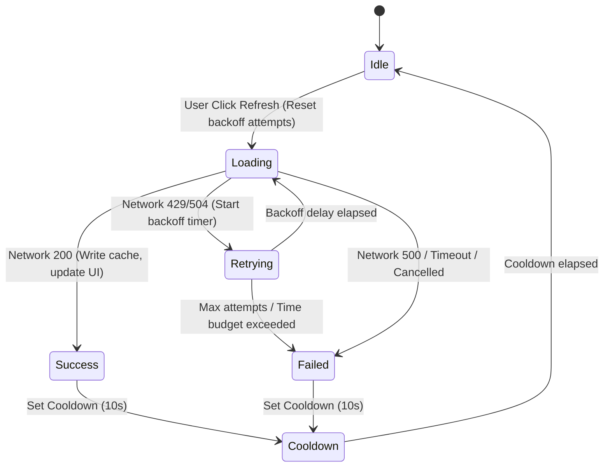

CTC-019 specifies a browser-durable Overpass cache and bounded request policy without implementing source export or PDF behavior.

## 1. Scope/readiness verdict and blocking unknowns

### Verdict
**READY FOR CRITICAL REVIEW**. The architecture, database schema, strict validation rules, Retry-After header parsing, bounded backoff strategy, and React state-machine integration are fully specified. They can be implemented on top of the native browser platform (IndexedDB, StorageManager, and Fetch APIs) without adding external production dependencies.

### Blocking Unknowns
There are no blocking unknowns. Primary-source research confirms that while the public Overpass API does not guarantee a `Retry-After` header in all rate-limit scenarios, the browser client can gracefully handle rate limiting by parsing standard `Retry-After` header variants (integer seconds or absolute IMF-fixdate) if present, and falling back to a deterministic bounded exponential backoff with random jitter if the header is absent or invalid.

---

## 2. Evidence table with primary-source URLs and access dates

| Topic / API | Source | URL | Access Date | Key Findings & Constraints |
| :--- | :--- | :--- | :--- | :--- |
| **IndexedDB API** | MDN Web Docs | [IndexedDB API](https://developer.mozilla.org/en-US/docs/Web/API/IndexedDB_API) | June 18, 2026 | Schema upgrades require a `versionchange` transaction. Connection version updates trigger `versionchange` and `blocked` events. |
| **IndexedDB Transactions** | MDN Web Docs | [IDBTransaction](https://developer.mozilla.org/en-US/docs/Web/API/IDBTransaction) | June 18, 2026 | Supports `durability` hints (`"strict"`, `"relaxed"`, `"default"`). Modern browsers default to `relaxed` for performance. |
| **Storage Quotas** | MDN Web Docs | [StorageManager.estimate()](https://developer.mozilla.org/en-US/docs/Web/API/StorageManager/estimate) | June 18, 2026 | Allows checking origin storage capacity. Private browsing limits quota and throws security errors on database creation. |
| **Fetch & AbortSignal** | WHATWG standard | [Fetch API Specification](https://fetch.spec.whatwg.org/) | June 18, 2026 | `AbortSignal` cancels fetch requests and rejects the promise with an `AbortError` `DOMException`. |
| **Retry-After Header** | RFC 9110 (HTTP Semantics) | [RFC 9110 Section 10.2.3](https://www.rfc-editor.org/rfc/rfc9110.html#section-10.2.3) | June 18, 2026 | Header format can be a non-negative decimal integer representing seconds or a standard IMF-fixdate HTTP-date. |
| **Forbidden Headers** | MDN Web Docs | [Forbidden Header Names](https://developer.mozilla.org/en-US/docs/Web/Glossary/Forbidden_header_name) | June 18, 2026 | Browser scripts cannot modify headers starting with `Sec-`, or headers like `User-Agent`, `Origin`, and `Referer`. |
| **Overpass API limits** | Overpass API Manual | [Overpass API Commons](https://dev.overpass-api.de/overpass-doc/en/preface/commons.html) | June 18, 2026 | Slots are queued or rejected. 10k requests/1GB download daily guidance. Excessive 429 retries can result in IP blocks. |
| **Live Regions** | W3C WAI-ARIA | [WAI-ARIA status role](https://www.w3.org/WAI/ARIA/apg/patterns/status/) | June 18, 2026 | Status changes should use `role="status"` (`aria-live="polite"`) and must not steal keyboard or screen reader focus. |
| **Accessible Disabled State** | W3C WAI-ARIA | [aria-disabled attribute](https://www.w3.org/WAI/ARIA/apg/practices/keyboard-interface/#aria-disabled) | June 18, 2026 | `aria-disabled="true"` keeps a control focusable in the tab order while indicating it is disabled, preventing focus loss. |

---

## 3. Durable-cache architecture and exact versioned schema

### Database Configuration
- **Database Name:** `"chart-the-course"`
- **Schema Version:** `1`
- **Object Store Name:** `"overpass-cache"`
- **Key Path:** `"key"` (exact string matches on discovery/detail cache keys)
- **Indexes:** One index is defined to optimize TTL cleanup:
  - **Index Name:** `"storedAt"`
  - **Key Path:** `"storedAt"`
  - **Unique:** `false`

### TypeScript Record Schema
```typescript
export interface DurableCacheRecord {
  key: string;               // Unique primary key (e.g. ctc:overpass:v1:detail:{bbox})
  version: number;           // Schema version (hardcoded to 1)
  storedAt: number;          // Timestamp in milliseconds (Date.now())
  rawResponse: string;       // Unmodified raw response text from Overpass
  odblLabel: string;         // Constant label: "OpenStreetMap contributors (ODbL)"
  source: {
    query: string;           // Exact Overpass QL query body sent
    endpoint: string;        // API interpreter endpoint URL
    completedAt: string;     // ISO 8601 string of request completion
    bbox: string;            // Serialized coordinate string (south,west,north,east)
    copyrightUrl: string;    // "https://www.openstreetmap.org/copyright"
  };
}
```

### Connection Lifecycle & Transaction Boundaries
1. **Lazy Singleton Connection:** A singleton class `OverpassCacheManager` manages a single open connection to the database. The database is opened on the first query request.
2. **Versionchange & Blocked Handling:**
   - The connection listens for the `versionchange` event on the database object. If a `versionchange` fires (indicating another tab is attempting to upgrade the schema), the connection immediately calls `db.close()` and degrades to in-memory caching for subsequent operations in that tab.
   - On the `IDBOpenDBRequest`, the manager listens for the `blocked` event. If triggered, it resolves the open request by falling back to session/in-memory storage and displays a warning in the status area.
3. **Transaction Scopes:**
   - **Read Operations:** Scoped as a single `readonly` transaction on `"overpass-cache"`. The transaction retrieves a single record using `store.get(key)`.
   - **Write Operations:** Scoped as a single `readwrite` transaction on `"overpass-cache"` using `store.put(record)`.
   - **Cleanup Operations:** Scoped as a single `readwrite` transaction on `"overpass-cache"`.
4. **Size Bounds:** To prevent quota exhaustion from massive erroneous files, individual responses exceeding **25 MB** (26,214,400 bytes) are processed for display but are rejected from durable storage.

---

## 4. Validation, TTL, stale, cleanup, quota, upgrade, and concurrency decisions

### Strict Versioned Entry Validation
Before a retrieved record is treated as a cache hit, it must pass the following checks:
1. `version` is exactly `1`.
2. `key` is identical to the requested cache key.
3. `storedAt` is a valid positive number not exceeding `Date.now() + 60000` (allowing a 1-minute future skew buffer).
4. The record is not expired: `Date.now() - storedAt < 604800000` (7 days in milliseconds).
5. `odblLabel` is exactly `"OpenStreetMap contributors (ODbL)"`.
6. `rawResponse` is a valid string. Parsing it must yield a JSON object containing an `elements` array, where every element is an object containing a valid `type` (`"node"`, `"way"`, or `"relation"`) and a finite integer `id`.
7. `source` is an object with valid fields:
   - `query` starts with a comment matching the query's identifying prefix.
   - `endpoint` matches the expected interpreter endpoint constant.
   - `completedAt` is a valid ISO 8601 string representing a timestamp within 60 seconds of `storedAt`.
   - `bbox` matches the decimal coordinates embedded in the query key.
   - `copyrightUrl` matches `https://www.openstreetmap.org/copyright`.

If any check fails, the entry is **invalid/corrupt**. A `readwrite` transaction immediately issues a `delete(key)` to evict the record, and the lookup returns a cache miss.

### TTL and Stale-Data Policy
- **TTL Duration:** Exactly 7 days (604,800,000 milliseconds).
- **Stale Fallback Strategy (Stale Hit):**
  - If a cached record exists but is stale (elapsed time $\ge$ 7 days but $<$ 30 days):
    - **Offline / Network Fail:** If the network request fails, or the browser reports `navigator.onLine === false`, the app automatically falls back to rendering the stale cache data with a visible banner: `"Offline mode: Displaying cached course data last updated [date]."`
    - **Online Mode:** The app displays a prompt: `"Stale cache data from [date] is available."` The user is given two choices:
      1. **Load Cached (Stale):** Immediately load the cache data. A banner displays: `"Stale course data: Last updated [date]."` The "Refresh course data" button remains enabled.
      2. **Fetch Fresh:** Bypass the cache and execute a new network request.
- **Cleanup Cadence:** Every time the database connection is successfully established, a background transaction runs a cursor on the `"storedAt"` index. It deletes all records where `storedAt` is older than 30 days (2,592,000,000 milliseconds).
- **Quota & Write Failures:** If a write operation throws a `QuotaExceededError` (or a `SecurityError` due to private browsing restrictions), the app ignores the storage failure, returns the network response successfully to the UI, and logs a warning message: `"Result loaded, but local cache could not be updated (Storage full or restricted)."`

---

## 5. Refresh action and accessible UI/state-machine contract

### UI Control Rules
1. **Refresh Button:** An explicit `"Refresh course data"` button is rendered adjacent to the search status when course geometry is loaded.
2. **Rate Limiting Cooldown:**
   - Once a search or refresh is initiated, a cooldown period of **10 seconds** is enforced for that cache key.
   - The cooldown time is checked against `performance.now()` to prevent local system clock tampering.
   - During the cooldown, the refresh button is visually styled as disabled and its text updates to show the countdown, e.g., `"Refresh cooldown (wait 8s)"`.
3. **Accessibility (Focus Preservation):**
   - Instead of setting the HTML `disabled` attribute (which removes the button from the tab order and causes screen readers to lose focus), the button uses **`aria-disabled="true"`** during loading and cooldown states.
   - In JavaScript, the click handler checks the `aria-disabled` attribute and aborts action if true. This preserves focus on the button while preventing repeated network requests.
4. **Live Announcements:** An `aria-live="polite"` status region announces state changes:
   - On click: `"Refreshing course data..."`
   - On success: `"Course data refreshed successfully."`
   - On failure: `"Refresh failed: [error message]."`

### Refresh State Machine Transitions



- **Cancellation:** If the user clicks `"Cancel request"` during `Loading` or `Retrying` states:
  - The active network fetch and any scheduled backoff `setTimeout` are aborted.
  - The state transitions to `Cancelled`.
  - The cache is left unmodified, and the current displayed geometry remains visible.

---

## 6. Retry-After, bounded backoff, timeout, cancellation, and request-identity contract

### 429/Retry-After Resolution
On receiving an HTTP `429` status code, the client first inspects the `Retry-After` header:
1. **Integer Format:** Parse as a base-10 integer representing delay seconds. If valid and $\le 300$ seconds, use it. If $> 300$ seconds, cap the wait at 30 seconds.
2. **HTTP Date Format:** Parse using `Date.parse()`. Calculate $delay = \lceil (parsedDate - Date.now()) / 1000 \rceil$. If the date is valid, in the future, and $\le 300$ seconds, use it. If in the past, default to 10 seconds.
3. **Missing or Invalid Header:** If the header is missing, empty, or cannot be parsed, fall back to **Bounded Exponential Backoff with Jitter**.

### Bounded Exponential Backoff with Jitter
- **Base delay:** 2 seconds.
- **Backoff multiplier:** $delay = \min(Base \times 2^{attempt} + Jitter, MaxDelay)$ where $attempt \in \{0, 1, 2\}$.
- **Max delay:** 30 seconds.
- **Jitter:** A random integer between 0 and 500 milliseconds is added to prevent synchronization storms. In test environments, a configuration flag `disableJitter: true` bypasses this offset.
- **Retries and Budget:**
  - **Maximum retries:** 3 attempts (4 total network requests).
  - **Total delay budget:** 45 seconds. Before scheduling a retry, the client calculates if the accumulated sleep time plus the next delay exceeds 45 seconds. If it does, retries are aborted, and the request fails with a rate-limit error.

### Cancellation Semantics
1. **Already-Aborted Signal:** Before starting any IndexedDB operation, wait, or fetch, the client asserts `if (signal.aborted) throw new DOMException("Request aborted", "AbortError")`.
2. **Cancellation Points:**
   - **IndexedDB Transactions:** Before launching the transaction and immediately after transaction completion, check the signal.
   - **Backoff Wait:** When `signal.addEventListener("abort", ...)` fires, the active backoff `setTimeout` is cleared via `clearTimeout()`, and the pending fetch promise rejects with an `AbortError`.
   - **Active Fetch:** The abort signal is passed to the browser `fetch` options. The browser terminates the TCP connection and rejects the promise.
   - **Response Body Read:** If aborted while reading the stream body (`response.text()`), the stream controller aborts reading and rejects the promise.

### Request Identity Constants
- **Identifying Comments:** The QL query body must start with the following prefix:
  `/* chart-the-course/{{version}} contact:{{contactUrl}} purpose:{{purpose}} */`
- **Referrer Policy:** Deployed requests allow the standard browser origin and referrer to pass using the default browser referrer policy (`strict-origin-when-cross-origin`).
- **Forbidden Header Policy:** The code must not attempt to modify forbidden headers like `User-Agent`, `Origin`, or `Referer`. Doing so violates W3C standards and is rejected by the browser.

---

## 7. ODbL/source-evidence ownership and explicit CTC-020 boundary

### ODbL Evidence Preservation
To satisfy the Open Database License (ODbL) Section 4.6 data-source policies:
1. **Preserved Raw Text:** The database cache stores the raw Overpass response text exactly as received, preventing loss of metadata during normalization.
2. **Explicit ODbL Metadata:** The cache record structure includes an explicit `odblLabel` field set to `"OpenStreetMap contributors (ODbL)"` and a `source.copyrightUrl` field set to `"https://www.openstreetmap.org/copyright"`. These fields serve as durable evidence of the data's licensing posture.

### Downstream Boundaries
- **Project Data Isolation:** User-authored project files (such as target lines, carry markers, and hole overlays) are stored in separate React states and are never combined with or written to the Overpass IndexedDB cache.
- **CTC-020 Non-Goal:** This task does not implement any source-export UI, file-download actions, or export schemas. It merely ensures that the raw evidence is durably cached in a format that satisfies downstream source-availability requirements when PDF export (CTC-008) and raw GIS export (CTC-020) are introduced.

---

## 8. Security, privacy, failure-state, and no-network-expansion decisions

### Security & Privacy Boundaries
- **Local Scope:** The IndexedDB database operates strictly within the local browser sandbox and is isolated by the Same-Origin Policy.
- **No Sensitive Data:** The cache stores only public OpenStreetMap golf course geometry. No player profiles, credentials, geographic telemetry, search histories, or user-authored notes are written to the database.
- **No Background Sync:** The app contains no service workers, background sync workers, cloud synchronization, or remote data analytics.

### Failure-State Handling
- **IndexedDB Unavailable:** If IndexedDB is blocked or throws security errors (e.g. inside private browsing on older iOS browsers), the app catches the error and falls back to session/in-memory storage. The UI remains functional, and a status message warns the user: `"Session storage fallback active."`
- **Network Failures:** If the network is disconnected, search queries fail immediately with a network error state and do not retry. Stale cache entries are rendered only if they exist in the database and the user accepts the stale fallback.
- **No Network Expansion:** The client must communicate exclusively with the single `OVERPASS_ENDPOINT` constant. Automatic endpoint failovers, third-party caching proxies, or dynamic provider switches are strictly prohibited.

---

## 9. Deterministic Vitest and network-isolated Playwright plan

### Vitest Unit Test Strategy (`src/overpass.test.ts`)
- **IndexedDB Mocking:** Since the Vitest Node environment lacks a native browser IndexedDB, a lightweight in-memory stub of the IndexedDB API (`IDBFactory`, `IDBDatabase`, `IDBTransaction`, `IDBObjectStore`) will be defined in a test helper file (`src/test/mockIndexedDB.ts`) and assigned to `globalThis.indexedDB` before running tests. This keeps tests self-contained and dependency-free.
- **Timer Virtualization:** Use `vi.useFakeTimers()` to test:
  - **TTL Boundaries:** Verify that a record stored $6.9$ days ago is returned as a hit, while a record stored $7.1$ days ago is flagged as stale.
  - **Clock Skew:** Verify that records with `storedAt` in the future by $> 1$ minute are evicted as corrupt.
  - **Backoff Sleeps:** Verify that the backoff timer schedules the correct delays and retries are executed at precise mock intervals.
  - **Refresh Cooldown:** Verify that the refresh button is locked for exactly 10 seconds.
- **Mocking Fetch:** Mock the global `fetch` object to simulate:
  - `429` responses with integer `Retry-After` headers.
  - `429` responses with IMF-fixdate `Retry-After` headers.
  - `429` responses with missing/invalid headers (triggering exponential backoff).
  - Cancellation behavior where aborting the signal mid-flight rejects the promise with `AbortError`.

### Playwright E2E Test Strategy (`test/e2e/app.spec.ts`)
- **Network Isolation:** All tests route requests using `page.route()`. Any request to external hosts (non-localhost) that is not explicitly mocked will trigger a test failure.
- **Test Scenarios:**
  1. **Cache Persistence Across Reloads:**
     - Perform a discovery search and detail request.
     - Verify that the status shows `"loaded"`.
     - Reload the page.
     - Re-submit the same coordinates.
     - Verify the status text: `"loaded from local cache"`. Confirm no network request was triggered.
  2. **Refresh Cooldown & Focus:**
     - Click the `"Refresh course data"` button.
     - Verify that the button updates to `"Refresh cooldown (wait 10s)"` and has `aria-disabled="true"`.
     - Verify that the tab focus remains on the refresh button.
     - Verify that clicking the button during the cooldown does not trigger a network fetch.
  3. **Retry-After Retries:**
     - Mock the Overpass endpoint to return `429` with `Retry-After: 1`, then return `200` with course detail.
     - Trigger a refresh and verify that the request succeeds after a 1-second delay.
  4. **Cancellation during Backoff:**
     - Mock the Overpass endpoint to return a `429` with a 10-second wait.
     - Click `"Refresh"`. Verify the retry state is active.
     - Click `"Cancel request"`.
     - Verify that the retry is canceled immediately, the status shows `"Request cancelled"`, and the current course map remains rendered.
  5. **Private Browsing Fallback:**
     - Mock the page environment to throw on `indexedDB.open()`.
     - Perform a search and verify that data is loaded successfully, with a warning message: `"Local cache is unavailable."`

---

## 10. Exact file/change plan, documentation updates, verification plan, and non-goals

### File and Change Plan
- **Create `docs/handoffs/ctc-019-antigravity-research-spec.md`:** This specification file.
- **Update `src/overpass.ts`:**
  - Create the `OverpassCacheManager` class to wrap IndexedDB operations (open, get, put, delete, and cleanup).
  - Implement the `parseRetryAfterHeader` utility to support decimal and IMF-fixdate string parsing.
  - Modify `fetchOverpass` to support exponential backoff, Retry-After header routing, jitter, max retry attempts, and abort checks.
- **Update `src/App.tsx`:**
  - Integrate async database cache checking.
  - Add `stale`, `retrying`, and `cooldown` states to the App state machine.
  - Render the `"Refresh course data"` button. Handle click logic, `aria-disabled`, focus retention, and status announcements.
- **Update `src/overpass.test.ts`:**
  - Add unit tests for database records, cache eviction, Retry-After formats, and backoff timing.
- **Update `test/e2e/app.spec.ts`:**
  - Add Playwright E2E tests for refresh cooldown, rate-limit backoffs, cancellation during wait, and database failures.

### Documentation Updates
- **`ATTRIBUTION.md`:** Add a note stating that cached course geometry is marked ODbL-covered in IndexedDB.
- **`docs/overpass-query-contract.md`:** Document the database schema structure, Retry-After behaviors, and backoff policy.
- **`SECURITY.md`:** Update to document the local IndexedDB security parameters (Same-Origin Policy, no user data cached).
- **`CONTEXT.md`:** Update active task memory state to indicate completion of Gemini spec drafting.

### Verification Plan
1. Run `git diff --check` to catch whitespace errors.
2. Run `npm run check` to verify the build, unit tests, and Playwright tests pass.
3. Run `npm run compliance` to confirm that direct dependencies remain exact-pinned and no production vulnerabilities exist.

### Non-Goals
- No raw GIS source export UI or download action (CTC-020).
- No PDF export rendering or UI (CTC-008).
- No server-side caching proxy or database server setup.
- No third-party tile providers or basemap rendering additions (CTC-018).

---

## 11. Adversarial QA red lines

The adversarial QA team must verify the following checks before authorizing the implementation:
1. **No Cache Hit on Corrupt Data:** If any validation check on a cached record fails (e.g. invalid `completedAt`, missing `odblLabel`, or incorrect `bbox`), the entry must be deleted from the database and treated as a cache miss.
2. **No Spoofed Forbidden Headers:** The client must not attempt to modify forbidden headers (`User-Agent`, `Origin`, or `Referer`).
3. **Strict Separation of Concerns:** Under no circumstances may user project files (containing targets or carries) be written to the Overpass IndexedDB database.
4. **Bounded Retry Budget:** The client must never exceed the 45-second total delay budget or the 3-attempt limit when backing off from rate limits.
5. **Complete Test Isolation:** No automated tests (Vitest or Playwright) may make external network requests to the public Overpass API.

---

## 12. Open maintainer decisions with conservative defaults

- **Cooldown Duration:** The default duration is set to **10 seconds**. Maintainers may evaluate if this should be increased to 30 seconds for public builds.
- **Backoff Max Delay:** The default max delay is set to **30 seconds**. Maintainers may decrease this to 15 seconds if they prefer faster failure feedback.
- **Storage Cleanup Age:** Stale records are preserved as fallbacks for 30 days before eviction. Maintainers may reduce this to 14 days to preserve disk space.
